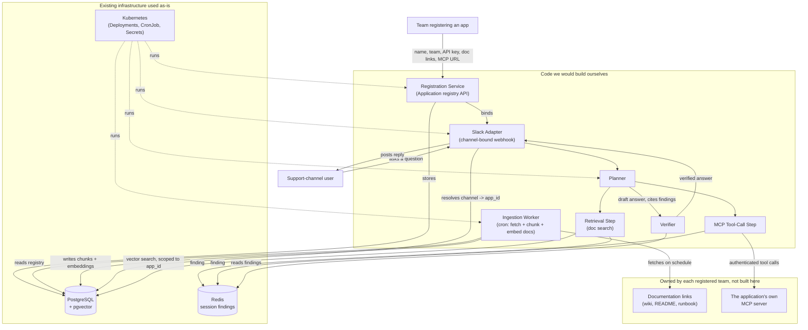
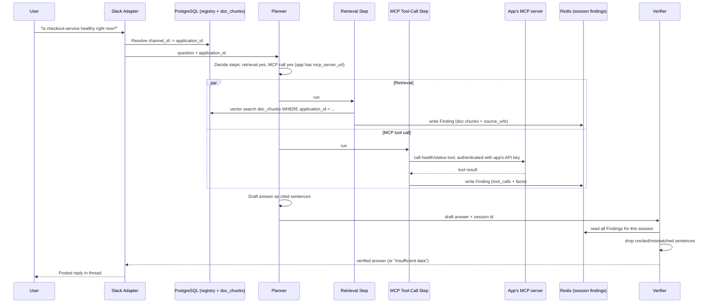

# AgentDesk: A Self-Service Agentic RAG Support Platform for Slack

**Status:** Design proposal. Not yet implemented.
**Builds on the same anti-hallucination pattern as:** [KafkaMind](../kafka-agent-mesh/README.md)
(planner → grounded specialist steps → verifier, adapted here from a Kafka fleet to an
arbitrary registered application).

## 1. Problem statement

A team running a production service typically has two separate knowledge sources a support
engineer needs during an incident or a routine question: **written documentation** (runbooks,
READMEs, wiki pages) and **live application state** (is it healthy right now, what do the
current metrics say). Today, answering a question in a Slack support channel means a human
manually checking both — searching docs, then separately querying dashboards or logs — and
there is no shared, reusable way for a team to plug their own service into an assistant that
does both automatically.

Existing internal chatbots that teams build ad hoc are typically single-purpose: one team
wires up a Slack bot against their own docs, another team never bothers because the effort
isn't worth it for one service. There is no **self-service registry** — a place where any
team can register their application once (a name, their team, their documentation links, and
optionally their own MCP server for live state) and immediately get a Slack-integrated
assistant scoped to that application, without writing any bot code themselves.

**Objective:** Design a platform where a team registers an application (name, team, optional
API key, document links, optional MCP server URL), binds it to one Slack channel, and from
then on any question asked in that channel is answered by an agent that retrieves from that
application's ingested documentation, optionally calls that application's own MCP server for
live context, and returns an answer in which every claim is traceable to a specific document
chunk or tool call — never an invented fact.

## 2. Prior art

- **[KafkaMind](../kafka-agent-mesh/README.md)** (this repo) — the direct architectural
  ancestor. Its planner → specialist-agent → verifier grounding pattern, and its
  registry-of-endpoints design (`cluster_registry`, resolved by a Metadata Agent before any
  other agent runs) are reused here almost unchanged, with "cluster" generalized to
  "registered application" and KafkaIQ tool calls generalized to an arbitrary app-supplied MCP
  server.
- **[k8sgpt](https://github.com/k8sgpt-ai/k8sgpt)** — origin of the "detect first, explain
  second" separation that both this design and KafkaMind's verifier step are built on.
- **Generic internal RAG-over-docs bots** (Glean, internal Slack-bot-plus-vector-DB setups
  common at most companies) — solve the documentation-retrieval half well, but none reviewed
  combine that with a per-application live-tool-call step gated by the same verification the
  documentation answers get; live state is usually either absent or answered by an
  unverified free-text tool call.
- **Backstage** (Spotify's internal developer portal) — the closest analog for the
  *registration* half of this design (a self-service catalog of services with owning teams
  and metadata), though it is a catalog and portal, not a RAG/agent system. Its "software
  catalog as the single source of truth for who owns what" idea is reused for the Application
  Registry (Section 6.1) without adopting Backstage itself.

**Conclusion:** the RAG-over-docs half of this problem is well-trodden; the gap is combining
it, per-application and self-service, with a verified live-context tool call — reusing
KafkaMind's grounding discipline outside of Kafka.

## 3. Goals & non-goals

**Goals**
- Let a team self-register an application: name, team, optional API key, one or more document
  links, and an optional MCP server URL — no platform-team involvement required.
- Bind one registered application to exactly one Slack channel; questions asked in that
  channel are answered scoped to that application only.
- Periodically (cron) re-fetch and re-embed each application's registered document links, so
  answers reflect current documentation without manual re-ingestion.
- When an application has registered its own MCP server, call it at question time for live
  context (health, current config, recent errors — whatever tools that application chooses to
  expose), authenticated with the application's own API key.
- Guarantee every sentence of a returned answer is traceable to either a retrieved document
  chunk or a live MCP tool call result — never a fact the model introduced on its own — using
  the same planner/finding/verifier separation as KafkaMind.
- Run on Kubernetes as several small, independently deployable services.

**Non-goals (v1)**
- **Multiple applications per team.** v1 is one registered application per team (1:1); a team
  with several services registers each under a different team-scoped name rather than a
  single team owning a list. Revisit if usage shows teams need shared ownership of many apps.
- **Microsoft Teams integration.** Slack is the v1 channel adapter; Teams is a same-pattern
  future adapter (Section 10), not built now.
- **File upload ingestion.** v1 ingests document **links** only (cron-refetched); direct file
  upload (PDF, Word) is a possible v2 addition, not part of this design.
- **Platform-hosted generic MCP tools.** If an application does not register its own MCP
  server, the platform does **not** substitute a generic fallback (e.g. a built-in "check pod
  status" tool) in v1 — the agent simply answers from documentation alone in that case. A
  shared fallback tool pack is a plausible v2 extension, not built now.
- **Multi-tenant question routing / shared channels.** A Slack channel maps to exactly one
  application; a shared "ask-anything" channel that infers which application a question is
  about is explicitly out of scope (Section 10, Alternative A).

## 4. How to read the diagrams in this document

Diagrams group pieces the same way as this repo's other designs:
- **Code we would build ourselves** — the platform's own services.
- **Existing infrastructure used as-is** — Kubernetes primitives, PostgreSQL/pgvector, Redis,
  the Slack API, and each registered application's own MCP server (which the platform calls
  into but does not build).

## 5. High-level architecture



**Why a per-application channel binding instead of a shared bot across all apps:** with one
channel per application, the Slack Adapter's only routing job is a single lookup
(`channel_id -> app_id`), and every downstream step is automatically scoped correctly with no
classification step that could misroute a question to the wrong application's docs or,
worse, call the wrong application's MCP server with the wrong credentials.

## 6. Components

### 6.1 Application Registry (part of the Registration Service)

The system of record for every registered application, in PostgreSQL:

```
applications
  id                 UUID (PK)
  name               TEXT, unique per team
  team               TEXT
  api_key_ciphertext BYTEA, nullable   -- encrypted at rest; used to call this app's MCP server
  mcp_server_url     TEXT, nullable
  slack_channel_id   TEXT, unique      -- enforces the 1 app : 1 channel invariant
  created_at         TIMESTAMPTZ
  updated_at         TIMESTAMPTZ

document_sources
  id            UUID (PK)
  application_id UUID (FK -> applications.id)
  url            TEXT
  cron_schedule  TEXT              -- e.g. "0 */6 * * *"; defaults to a platform-wide interval
  last_fetched_at TIMESTAMPTZ, nullable
  last_status    TEXT              -- ok | fetch_error | unchanged
```

A unique constraint on `slack_channel_id` is what makes "one channel = one app" a database
guarantee rather than a convention the Slack Adapter has to trust.

### 6.2 Ingestion Worker (code we build)

A Kubernetes `CronJob`, one run per platform-wide tick (e.g. hourly), that:
1. Reads all `document_sources` due for refresh.
2. Fetches each URL, and skips re-embedding unchanged content (a content hash comparison
   against the previous fetch) so unchanged pages don't churn embeddings for no reason.
3. Chunks changed documents (500–1000 tokens, with overlap) and writes new embeddings to
   `doc_chunks`, scoped by `application_id`:

```
doc_chunks
  id             UUID (PK)
  application_id UUID (FK -> applications.id)
  source_url     TEXT
  chunk_index    INT
  chunk_text     TEXT
  embedding      VECTOR(1536)   -- pgvector column
  fetched_at     TIMESTAMPTZ
```

Every retrieval query filters on `application_id` first, then does the vector similarity
search — application isolation at the query level, not just at the ingestion level.

### 6.3 Slack Adapter (code we build)

Receives Slack events (a message in a bound channel), resolves `slack_channel_id -> application_id`
against the registry, and hands the question plus `application_id` to the Planner. On the way
back, posts the verified answer into the same thread. This is the only component that speaks
Slack's API — if Teams is added later (Section 10), it becomes a second adapter with the same
contract into the Planner, not a change to any other component.

### 6.4 Planner (code we build)

Given a question and an `application_id`, decides which of the two available steps to run:
- **Retrieval Step** — always run if the application has any `doc_chunks`.
- **MCP Tool-Call Step** — run only if the application registered an `mcp_server_url`; the
  Planner does not invent tool calls for applications that didn't register a server.

Both steps run independently (in parallel where both apply) and each writes a structured
**Finding** to Redis, scoped to a per-question session, before the Planner drafts an answer.
This mirrors KafkaMind's Main Agent / specialist-agent split directly: the Planner plans and
later drafts prose, but never states a fact that didn't come from a Finding.

### 6.5 Retrieval Step (code we build)

Runs a pgvector similarity search over `doc_chunks` filtered to the question's `application_id`,
takes the top-k matches, and writes them as a Finding (Section 7.1) — the chunk text and its
`source_url` are the citable facts here, nothing is summarized or reworded at this stage.

### 6.6 MCP Tool-Call Step (code we build)

Connects as an MCP client to the application's registered `mcp_server_url`, authenticating
with the application's own API key (decrypted only in memory, for the duration of the call).
It calls whichever tools that application's MCP server exposes and are relevant to the
question (tool selection is part of the Planner's plan, same as KafkaMind's per-question tool
selection), and writes the raw tool results as a Finding. If the call fails or times out, the
Finding's `status` is `error` — the step does not retry indefinitely or fabricate a result.

### 6.7 Verifier (code we build)

Identical algorithm to KafkaMind's Verifier Agent (Section 8.3 here mirrors KafkaMind Section
6.4): the Planner must produce its draft as sentences that each cite Finding fact IDs; the
Verifier mechanically checks every citation resolves, drops uncited or contradicting
sentences, and downgrades to an explicit "insufficient data" reply if no Finding was usable at
all — for example, an application with no ingested docs yet and no MCP server registered.

## 7. Registration & ingestion flow

```mermaid
sequenceDiagram
    participant Team
    participant Reg as Registration Service
    participant PG as PostgreSQL
    participant Ing as Ingestion Worker (CronJob)
    participant Docs as Team's documentation links

    Team->>Reg: Register app (name, team, API key, doc links, MCP URL, Slack channel)
    Reg->>PG: Insert applications + document_sources rows
    Note over Ing: Runs on schedule, independent of registration time
    Ing->>PG: Read document_sources due for refresh
    Ing->>Docs: Fetch each URL
    Docs-->>Ing: Page content
    Ing->>Ing: Hash content; skip if unchanged
    Ing->>PG: Chunk + embed changed docs into doc_chunks
```

## 8. Live question-answering flow



## 9. LLD — Finding schema and verification algorithm

Reused from KafkaMind (Sections 6.3–6.5 there) with "cluster" generalized to "application" and
tool source generalized from KafkaIQ to whatever MCP server the application registered.

### 9.1 Finding envelope

```json
{
  "step": "mcp_tool_call",
  "application_id": "8f2b...",
  "tool_calls": [
    {
      "tool": "get_health",
      "arguments": {},
      "result": { "status": "degraded", "error_rate_pct": 4.2 },
      "called_at": "2026-09-12T10:14:02Z"
    }
  ],
  "facts": [
    {
      "id": "mcp_tool_call.0",
      "statement": "checkout-service health status is degraded, error rate 4.2 percent",
      "source_tool_call": 0
    }
  ],
  "status": "ok"
}
```

`status` is one of `ok`, `partial`, or `error`, identical in meaning to KafkaMind's Finding
status. The Retrieval Step's Findings use the same envelope, with `facts[].statement` holding
the chunk text and an added `source_url` field instead of `source_tool_call`.

### 9.2 Verifier algorithm

1. Every sentence in the Planner's draft must carry a `cites` list of fact IDs; a sentence
   citing an ID absent from this session's Findings is dropped.
2. An uncited sentence is dropped unless flagged as purely structural by the Planner at
   generation time (e.g. a heading).
3. If neither the Retrieval Step nor the MCP Tool-Call Step (for applications that registered
   one) produced a usable Finding, the entire answer is replaced with an explicit
   "insufficient data" response, naming which step failed — for example, "no documentation
   has been ingested yet for this application" or "the application's MCP server did not
   respond."

## 10. Kubernetes deployment shape

| Component | Kubernetes shape | Notes |
|---|---|---|
| Registration Service | Deployment + Service | Stateless REST API in front of PostgreSQL |
| Ingestion Worker | CronJob | One scheduled run per tick; idempotent per document via content hashing |
| Slack Adapter | Deployment + Service (webhook endpoint) | Stateless; a second Deployment for a Teams adapter later reuses the same contract into the Planner |
| Planner / Retrieval / Tool-Call / Verifier | Single Deployment (one service, internal steps) or split further if load requires it | Grouped in v1 since none of the four has an independent scaling need yet |
| PostgreSQL + pgvector | StatefulSet (or managed instance) | System of record for the registry and all embeddings |
| Redis | StatefulSet (or managed instance) | Ephemeral per-question session Findings only — nothing long-lived is stored here |
| Application API keys | Kubernetes Secret-backed encryption key; ciphertext stored in PostgreSQL | The platform never stores a plaintext key at rest |

Each registered application's own MCP server is **not** part of this platform's Kubernetes
footprint — it runs wherever that application already runs; the platform only holds its URL
and calls into it over the network, the same way KafkaMind's specialist agents call into an
already-running KafkaIQ instance rather than embedding Kafka itself.

## 11. Security & isolation model

- **Per-application isolation at the query layer.** Every `doc_chunks` read and every MCP
  tool call is scoped by `application_id`; there is no cross-application query path, so one
  team's channel can never surface another team's documents or call another team's MCP
  server.
- **API keys encrypted at rest**, decrypted only in memory for the duration of an MCP call,
  never logged, never included in a Finding.
- **Slack channel binding is a unique-constraint invariant**, not an application-level check —
  a misconfiguration cannot silently bind two applications to the same channel.
- **The MCP Tool-Call Step calls only the URL registered for that application** — no
  dynamically-constructed URL, no fallback to guessing an endpoint.
- **No generic platform-side tool access.** Because there is no platform-hosted fallback tool
  pack (Section 3, non-goals), the platform never has standing access to any infrastructure
  beyond what an application explicitly registered and authorized with its own key.

## 12. Alternatives considered

**A. Shared "ask-anything" channel with per-question app inference (rejected)** — one Slack
channel serves all registered applications, and an extra classification step guesses which
application a question is about. Rejected because misclassification risks answering from the
wrong application's docs or, worse, calling the wrong application's MCP server; the 1:1
channel binding removes this failure mode entirely at the cost of one channel per app.

**B. Dedicated vector database (e.g. Qdrant) instead of pgvector (rejected for v1)** — a
purpose-built vector engine scales better for very large corpora and heavier filtering, but
adds a second database technology to operate for what is, per application, a modest
documentation corpus. pgvector keeps the registry and the embeddings in one database and one
operational surface; revisit if per-application corpora grow large enough that pgvector's
performance becomes the bottleneck.

**C. Single agent with inline citations instead of planner + verifier split (rejected)** — a
simpler design where one agent retrieves docs, calls MCP tools, and answers directly with
inline source citations, the same shape as an ordinary RAG chatbot. Rejected in favor of
reusing KafkaMind's planner/finding/verifier separation, since a mechanical, structural check
on citations is a stronger hallucination guarantee than trusting the same model that drafted
the answer to also cite it honestly.

**D. Platform-hosted generic MCP tools as a fallback (deferred, not rejected)** — a built-in
tool pack (e.g. a generic Kubernetes pod-status check) usable by any application that didn't
register its own MCP server. Deferred rather than rejected: it's a reasonable v2 addition once
it's clear which generic checks are common enough across registered applications to be worth
building once, but building it now risks guessing wrong about what teams actually need.

## 13. Glossary

| Term | Meaning |
|---|---|
| **Application** | One registered unit on the platform: a name, owning team, optional API key, document links, optional MCP server URL, and a bound Slack channel |
| **Finding** | A structured, per-question record of either retrieved document chunks or MCP tool-call results, written before any answer is drafted |
| **Planner** | Decides which steps (retrieval, MCP tool call) to run for a given question and later drafts the answer as cited sentences |
| **Verifier** | Mechanically checks every sentence in a draft answer cites a real Finding fact; drops or replaces what it can't verify |
| **Channel binding** | The unique mapping from one Slack channel to exactly one registered application |
| **pgvector** | A PostgreSQL extension adding a vector column type and similarity search, used here instead of a separate vector database |
| **MCP (Model Context Protocol)** | The protocol a registered application's own server implements to expose live-context tools the platform's agent can call |

## 14. Frequently asked questions

**What happens if an application registers no MCP server?**
The MCP Tool-Call Step is simply never run for it; answers come from documentation retrieval
only, same as any other application, just with one fewer available Finding source.

**What happens if an application has no documents and no MCP server yet?**
The Verifier has no usable Finding to check against, so the answer is the explicit
"insufficient data" response rather than a guess — this is the same rule as KafkaMind's
insufficient-data behavior.

**Can two applications share one Slack channel?**
No — `slack_channel_id` is a unique constraint in the registry; registering a second
application against an already-bound channel is rejected at registration time.

**Why generalize KafkaMind's pattern instead of designing grounding from scratch?**
The planner/finding/verifier split is the part of KafkaMind already proven sound in this
repo's own review process; reusing it here means the only genuinely new design surface is the
registry and the per-application isolation model (Sections 6.1 and 11), not the grounding
mechanism itself.

## 15. Open questions for review

- Final platform name/branding (this document uses "AgentDesk" as a working name).
- Embedding model and dimensionality (this document uses 1536 as a placeholder, matching a
  common OpenAI embedding size — not yet decided).
- Whether the platform-wide cron interval is fixed or configurable per `document_source` in
  v1 (the schema in Section 6.1 already supports a per-source `cron_schedule`, but whether the
  Ingestion Worker honors per-source schedules or only a single platform-wide tick in v1 is
  still open).
- Whether an application can update its own registration (rotate its API key, add doc links)
  via a self-service API, or only through direct database access in v1.
- Exact tool-selection mechanism inside the Planner (how it decides which of an application's
  exposed MCP tools are relevant to a given question) — not yet designed in this document.
- The Teams adapter (Section 10) and generic tool-pack fallback (Section 12, Alternative D)
  remain named v2 extension points, not designed here.
