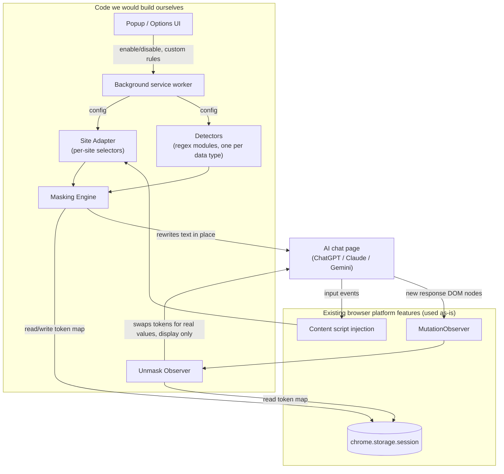

# InfraMask: A Reversible Infra-Identifier Masking Browser Extension for AI Chat UIs

**Status:** Design proposal. Not yet implemented.

## 1. Problem statement

Developers routinely paste real operational details — Kafka bootstrap servers, internal
hostnames, IP addresses, ports, connection strings — into the web UI of ChatGPT, Claude, or
similar tools to get debugging help. The moment that message is sent, those values leave the
organization's boundary, with no local control over what left and no way to know if the
assistant's own answer is safe to read back without exposing them again on screen or in logs.

A prior employer had an internal browser plugin that solved exactly this: it would
automatically detect and mask that kind of sensitive data before it reached the AI, and the
masking was reversible enough that the assistant's answer still made sense. This document
designs an open-source equivalent from scratch, focused specifically on infrastructure
identifiers rather than general personal data.

**Objective:** A Chrome extension that, as a developer types into a supported AI chat UI,
detects infra identifiers and replaces them with per-session placeholder tokens before the
message is sent, then automatically restores those tokens back to their real values in the
assistant's displayed response — with masking fully visible and editable in the input box
itself, and no real value ever written to disk, transmitted anywhere, or synced.

## 2. Prior art review

Before designing this, the existing landscape of "mask sensitive data before sending to an
AI chat" tools was reviewed, to confirm the gap is real and to borrow proven patterns rather
than reinvent them.

| Project | Reversible (auto-restore in response)? | Primary focus | License | Browser extension? |
|---|---|---|---|---|
| [ChatWall](https://github.com/ChatWall-io/chatwall) | Yes — click-to-unmask via ephemeral token map | Generic PII (names, emails, phones, IBANs, cards, API keys, JWTs) | **All-rights-reserved, source-visible only** — explicitly forbids redistribution, forking-and-republishing, or store uploads (see Section 2.1) | Yes (Chrome + Firefox) |
| [pi-privacy-filter](https://github.com/codingcoffee/pi-privacy-filter) | Yes — fully automatic restore | Generic PII via an ML classifier | MIT | No — a plugin for the `pi.dev` CLI, not a browser extension |
| [pii-guard](https://github.com/Mr-Neutr0n/pii-guard) | No — one-way replacement with generic placeholders | Generic PII + IPs, via NER (Presidio/spaCy) | MIT | Yes, + local proxy |
| [pii-prompt-shield](https://github.com/svenboesiger/pii-prompt-shield) | No — warn/block before send, no restore | Generic PII | Unspecified | Yes (Chrome + Firefox) |
| MaskGPT, MaskPrompt, PrivacyScrubber | Mixed; PrivacyScrubber offers a manual "Restore" click | Generic PII / API keys | Unspecified / proprietary | Yes |

**Conclusion:** the "mask before sending to an AI chat" category is real and already has
several entrants, but every one of them targets generic personal data (names, emails, credit
cards) as the primary case, with infrastructure identifiers — bootstrap servers, internal
hostnames, IP/port pairs — treated as an afterthought if at all. None combine (a) automatic,
no-click reversibility, (b) infra identifiers as the primary detector set, and (c) a genuinely
open-source license. That combination is the gap this design fills.

### 2.1 On ChatWall specifically

ChatWall's publicly documented architecture (Shadow DOM input overlay, ephemeral
token-mapping in `chrome.storage.session`, per-detector regex modules) is the closest
existing match to what this design does, and is cited here as design inspiration. Its
license, however, explicitly states the source may be viewed for auditing and modified for
personal use only — it may **not** be redistributed, republished, or uploaded to any
extension store, modified or not, and commercial distribution is "strictly prohibited"
(copyright StarObject S.A.). No code from that project is reused anywhere in this design;
only the publicly described architectural pattern is referenced, which is not something its
license can restrict.

## 3. Goals & non-goals

**Goals**
- Detect infra identifiers — IPv4/IPv6 addresses, hostnames/FQDNs, Kafka-style
  bootstrap-server strings (comma-separated `host:port` lists), standalone ports tied to a
  host, and internal URLs — as the user types into a supported AI chat UI's input box.
- Replace each match with a per-session placeholder token before the message can be sent,
  visibly, inside the real input box (not a separate overlay).
- Automatically restore those tokens back to their real values when the assistant's response
  references them, for on-screen display only.
- Never write a real value to disk, never transmit it anywhere but the box it was typed into
  (post-masking), never sync it across devices.
- Ship as a permissively licensed (MIT or Apache-2.0), installable Chrome extension anyone
  can audit, fork, and redistribute freely.

**Non-goals (v1)**
- Generic PII (names, emails, SSNs, credit cards) — a different, already-crowded problem;
  a possible v2 detector pack, not part of this design.
- Firefox/Safari support — Manifest V3, Chromium-family browsers only for v1.
- Network-layer interception (rewriting an outgoing `fetch`/`XHR` body). Masking happens
  visibly in the input box the user is typing into, not invisibly at the network layer.
- Any server-side or team-wide policy enforcement. This is a personal, local browser tool —
  not a DLP gateway or an admin-managed compliance product.

## 4. How to read the diagrams in this document

Every diagram groups pieces into two categories:
- **Code we would build ourselves** — new code written specifically for this extension.
- **Existing browser platform features used as-is** — Chrome extension APIs
  (`chrome.storage.session`, `MutationObserver`, content scripts) that already exist and are
  simply used, not written from scratch.

## 5. High-level architecture



The "Code we would build ourselves" group is the entire project — six small pieces of
JavaScript. Everything in "Existing browser platform features" is a Chrome extension API the
browser already provides, the same way any web app "uses" `localStorage` without writing
storage itself.

**Why an adapter layer instead of one generic script:** ChatGPT, Claude.ai, and Gemini each
use different input elements (`contenteditable` divs with different selectors) and different
send mechanics (Enter key vs. a specific button). Isolating that per-site knowledge into a
small adapter config, rather than scattering `if (hostname === ...)` checks through the
masking logic, means adding a new site is a data change, not a logic change — and a site's
DOM update only requires touching its one adapter, not the shared engine.

## 6. Components

### 6.1 Site Adapter (code we build)

A small config object per supported site, e.g.:

```js
{
  hostname: "chatgpt.com",
  inputSelector: "#prompt-textarea",
  sendTriggers: ["Enter-without-Shift", "button[data-testid='send-button']"],
  responseContainerSelector: "[data-message-author-role='assistant']"
}
```

Nothing else in the extension knows what a "ChatGPT" or "Claude" DOM looks like — every other
component only deals with plain text and DOM nodes handed to it by the adapter layer.

### 6.2 Detectors (code we build)

Pure functions: `text -> [{ type, start, end, value }]`. One module per data type, independently
unit-testable with no DOM dependency at all:

| Type | Example match | Notes |
|---|---|---|
| IPv4 | `10.4.12.9` | Standard dotted-quad regex |
| IPv6 | `fe80::1ff:fe23:4567:890a` | Full and compressed forms |
| Hostname / FQDN | `broker-3.kafka.internal.corp` | Requires at least one dot and a plausible TLD/internal suffix, to avoid matching ordinary dotted words |
| Kafka bootstrap-server string | `broker1:9092,broker2:9092,broker3:9092` | Comma-separated `host:port` list; detected as one unit so all three brokers share correlated tokens |
| Port bound to a host | `10.4.12.9:5432` | Matched together with its host, not as a bare number, to avoid masking unrelated numbers |
| Internal URL | `http://internal-svc.corp:8080/health` | Reuses the hostname/port detectors internally |

Detectors run in a fixed priority order (most specific first — e.g. bootstrap-server strings
before bare hostnames) and matches are resolved **longest-match-wins** on overlap, so a
hostname embedded in a URL is masked once, as part of the URL, not twice.

### 6.3 Masking Engine (code we build)

On a debounced input event, re-scans the box's current text, and for each new match:
1. Checks the token store for this exact value already having a token this session — if so,
   reuses it (so the same broker mentioned three times gets the same token every time).
2. Otherwise mints a new token and stores the mapping.
3. Replaces the match in the live input box, preserving cursor position so typing isn't
   interrupted.

Only **new, previously-unmasked** matches are touched on each pass — already-masked tokens in
the box are left alone, so editing text elsewhere doesn't re-run replacement on stable content.

### 6.4 Token Store (existing platform feature, `chrome.storage.session`)

A bidirectional map, `realValue <-> token`, scoped per browser tab. Token format uses a
bracket pair unlikely to occur in ordinary prose or code, e.g. `⟦IP_1⟧`, `⟦HOST_2⟧`,
`⟦BOOTSTRAP_3⟧`. `chrome.storage.session` is chosen specifically because it lives in memory
for the life of the browser session, is never written to disk, and is never synced to a
Google account — closing the browser wipes it completely.

### 6.5 Unmask Observer (code we build)

A `MutationObserver` watches the site adapter's response container. When new text nodes
appear, it scans them for token patterns and swaps each one for its real value from the
token store, purely for on-screen display — nothing is re-sent or re-transmitted at this
step, so unmasking here can never leak data back out.

### 6.6 Popup / Options UI (code we build)

Per-site on/off toggle, per-data-type toggle (e.g. disable IPv6 if it's producing false
positives), a view of the current tab's live token map for transparency, and a one-click
"clear this session's tokens" action.

### 6.7 Background service worker (code we build)

Minimal by design: holds extension-wide configuration, relays it to content scripts on
install/update, and updates the toolbar badge with a count of currently-masked values in the
active tab. It does not see message content — masking and unmasking both happen entirely
inside the content script running on the page.

## 7. End-to-end data flow

```mermaid
sequenceDiagram
    participant User
    participant Box as Input box (page DOM)
    participant ME as Masking Engine
    participant Store as Token Store (chrome.storage.session)
    participant AI as AI provider
    participant UO as Unmask Observer

    User->>Box: Types "check broker1:9092,broker2:9092"
    Box->>ME: input event (debounced)
    ME->>Store: Has "broker1:9092,broker2:9092" been tokenized this session?
    Store-->>ME: No
    ME->>Store: Store mapping ⟦BOOTSTRAP_1⟧ = "broker1:9092,broker2:9092"
    ME->>Box: Replace in place with "check ⟦BOOTSTRAP_1⟧"
    User->>Box: Presses Enter
    Box->>AI: Sends masked text only
    AI-->>Box: Response mentions "⟦BOOTSTRAP_1⟧ looks under-replicated"
    Box->>UO: MutationObserver fires on new response node
    UO->>Store: Look up ⟦BOOTSTRAP_1⟧
    Store-->>UO: "broker1:9092,broker2:9092"
    UO->>Box: Swap token for real value, display only
```

**Step by step:**
1. As the user types, the Masking Engine re-scans the box's text on a short debounce (so it
   doesn't run on every keystroke).
2. Each detector reports matches; overlaps resolve longest-match-wins; new matches are looked
   up against the Token Store to reuse an existing token or mint a new one.
3. The input box's visible content is rewritten in place, cursor position preserved.
4. The user sends the message as normal — the AI provider only ever receives the masked text.
5. When the AI's response arrives and is rendered into the page, the Unmask Observer's
   `MutationObserver` fires on the new DOM nodes.
6. Any token pattern found is looked up in the Token Store and swapped for its real value —
   this substitution is purely visual, in the already-rendered response; it is never sent
   anywhere.
7. Closing the tab (or the browser) clears `chrome.storage.session`, and with it every
   mapping — nothing persists past the session.

## 8. Security & privacy model

- All detection, masking, and unmasking happens inside the content script running in the
  user's own browser tab — no network calls the extension itself initiates, and no separate
  server component exists.
- Real values live only in `chrome.storage.session`: in-memory for the session's lifetime,
  never written to disk, never synced across devices.
- `manifest.json` scopes content-script injection to the specific supported hostnames (e.g.
  `chatgpt.com`, `claude.ai`) via `matches` — not `<all_urls>` — so the extension has no
  reach into unrelated pages.
- Because it is open source under a permissive license, anyone can audit exactly what the
  extension does before installing it, which is the actual trust mechanism here — not a
  claim to be taken on faith.

## 9. Editing & UX edge cases

| Case | Behavior |
|---|---|
| User's cursor lands inside an already-masked token | Treated as one atomic unit — arrow keys and backspace move across/delete the whole token, not individual characters of it, to prevent a corrupted half-token from being sent |
| A detector produces a false positive (e.g. a version string that looks like an IP) | Clicking a token reverts it to the original raw text before sending; a per-tab "pause masking" toggle is available for one-off cases |
| Same real value appears multiple times in one message | Reuses the same token every time, so the AI can still reason about "the three brokers" as three distinct, consistently-labeled entities |
| Two unrelated conversations open in different tabs | Token Store is scoped per tab, so tokens never collide or leak across unrelated conversations |
| A supported site changes its DOM structure | Only that site's adapter config needs updating — the detectors, masking engine, and token store are unaffected |

## 10. Alternatives considered

**A. Shadow DOM input overlay** (the architecture ChatWall's public documentation describes,
not its code) — replaces the native input box with an isolated overlay element, so the host
page's own scripts can never read a keystroke before masking runs. Stronger isolation, but
it means also reimplementing every supported site's send behavior (Enter-to-send, button
click, keyboard shortcuts) against the fake box instead of using the site's own submit path.
Not chosen for v1, since the goal is transparent editing of the real box, not a parallel UI.

**B. In-place DOM masking (chosen)** — content scripts attach directly to each site's real
input element and rewrite matched text there. Simpler per-site integration (no need to
reimplement submit behavior), and matches the requirement that masking be visible and
editable in the actual box the user is typing into.

**C. Network-layer interception** — rewrite the outgoing `fetch`/`XHR` request body instead
of touching the DOM at all. Rejected: it would be invisible to the user (defeats the
transparency goal), and it is fragile against per-site API changes, streaming response
formats, and request-signing that a masking layer would otherwise have no reason to touch.

## 11. Testing strategy

- **Detectors** are pure functions with no DOM dependency — unit-tested directly (Vitest or
  Jest) against a fixture list of true positives and known false-positive traps (e.g.
  version numbers, dates that resemble IPs).
- **Masking Engine and Unmask Observer** are tested against small static HTML fixtures that
  reproduce each supported site's relevant DOM shape, so cursor-preservation and token
  round-tripping can be verified without a live network call to a real AI provider.
- **Site Adapters** are verified with a manual checklist run against the live ChatGPT, Claude,
  and Gemini web UIs before each release, since automating full end-to-end runs against
  third-party, login-walled sites is impractical to maintain reliably.

## 12. Glossary

| Term | Meaning |
|---|---|
| **Token** | A placeholder string (e.g. `⟦IP_1⟧`) that stands in for a real sensitive value for the duration of a browser session |
| **Site Adapter** | Small per-site config describing where the input box, send action, and response container are in that site's DOM |
| **Detector** | A pure function that finds one specific kind of sensitive value in a block of text |
| **Content script** | JavaScript a browser extension injects into matching pages, running in the page's context |
| **`chrome.storage.session`** | An in-memory, non-synced, non-persisted browser storage area that is wiped when the browser session ends |
| **`MutationObserver`** | A browser API that notifies code when specified parts of the page's DOM change |
| **Bootstrap server** | The initial `host:port` (or comma-separated list of them) a Kafka client connects to, to discover the rest of the cluster |
| **Longest-match-wins** | The overlap-resolution rule: when two detectors match overlapping text, the longer match is kept and the shorter one discarded |

## 13. Frequently asked questions

**Why not just reuse ChatWall?**
Its source is visible for auditing, but the license explicitly forbids redistributing,
forking-and-republishing, or store-uploading it, modified or not, and prohibits commercial
distribution. It cannot legally be the base for an open-source release. See Section 2.1.

**Does the AI provider ever see the real value?**
No. Masking happens in the input box before the message is sent; the AI only ever receives
the token.

**What happens to the token map when I close the tab?**
It is discarded immediately — it lives only in `chrome.storage.session`, which is
memory-backed and scoped to the browser session.

**What if a detector masks something that isn't actually sensitive?**
Click the token to revert it to plain text before sending, or use the per-tab pause toggle
for a one-off message.

**Why in-place editing instead of a separate secure overlay like ChatWall's?**
Because the goal here is transparency — you see and can edit exactly the masked text that
will be sent, in the same box you're already typing in, rather than a parallel UI element.

## 14. Open questions for review

- Final extension name/branding (this document uses "InfraMask" as a working name).
- License choice: MIT vs. Apache-2.0 (the latter adds an explicit patent grant, relevant if
  companies might contribute).
- Which additional sites to support at launch beyond ChatGPT and Claude.ai — Gemini and
  local self-hosted LLM UIs (e.g. Open WebUI) are candidates for v1.1.
- Whether user-defined custom regex rules ship in v1 or are deferred to a later release.
- Exact token bracket characters, chosen to avoid colliding with legitimate use of similar
  bracket notation in mathematical or code-heavy prompts.
