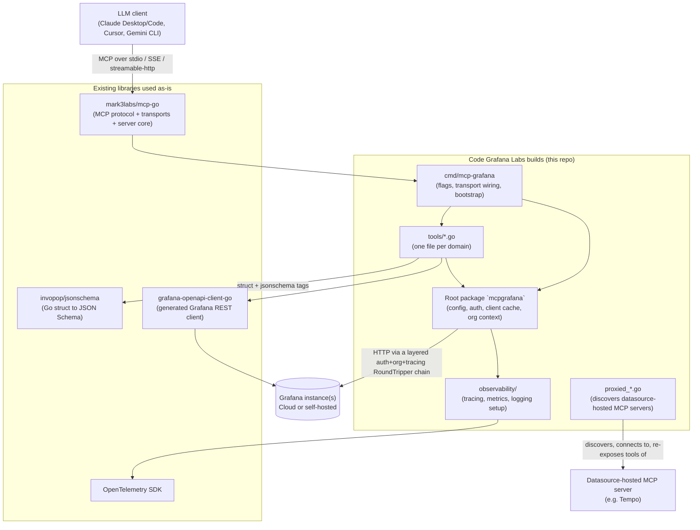
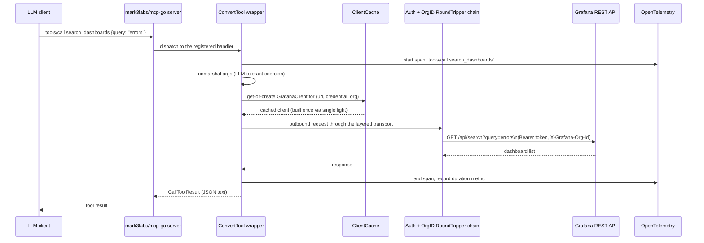

# mcp-grafana Architecture Review

**Status:** Architecture review of an existing open-source project. Documentation only — no
code in this repo, no relationship to Grafana Labs beyond reading their public source.
**Subject:** [grafana/mcp-grafana](https://github.com/grafana/mcp-grafana), reviewed at the
revision checked out locally under `C:\tmp\opensource\Contribution-projects\mcp-grafana`.
**Feeds into:** [mcp-server-design-lessons](../mcp-server-design-lessons/README.md) — the
generalized checklist derived from this review, for building a *different* MCP server from
scratch.

## 1. What this document is

This is not a design proposal — it is a review of how an existing, production-grade MCP
(Model Context Protocol) server is actually built, written to understand it well enough to
extract reusable lessons before designing something new. Every claim below is sourced from
the real source tree, cited by file path.

## 2. Purpose & tech stack

mcp-grafana is an MCP server that exposes Grafana and the observability ecosystem around it
— Prometheus, Loki, Elasticsearch/OpenSearch, Alerting, Incident, OnCall, Sift, Pyroscope,
ClickHouse, Snowflake, CloudWatch, Athena, InfluxDB, Graphite, and more — as callable tools
for LLM clients (Claude Desktop, Claude Code, Cursor, Gemini CLI). It is written in Go
(`go.mod`, `go 1.26.5`) on top of the third-party SDK **`mark3labs/mcp-go` v0.58.0** — not
Anthropic's official Go SDK. Other key dependencies: `invopop/jsonschema` (Go struct → JSON
Schema reflection), `grafana-openapi-client-go` (generated Grafana REST client), and a full
OpenTelemetry stack for tracing/metrics/logs.

## 3. How to read the diagrams in this document

Every diagram groups pieces into two categories:
- **Code Grafana Labs builds (this repo)** — the actual project.
- **Existing libraries used as-is** — third-party packages the project depends on rather
  than reimplementing.

## 4. High-level architecture



The entire project is a thin, carefully-organized layer over `mark3labs/mcp-go`: the SDK
owns the MCP protocol and transports, and this repo's job is turning ~124 Go functions into
well-described tools, authenticating them against one or more Grafana instances, and
observing the result.

## 5. Entry point, flags & transports

`cmd/mcp-grafana/main.go` is the sole entry point. It parses roughly thirty CLI flags
(transport, address, per-category `--disable-*` tool flags, an `--enabled-tools` allowlist,
TLS, a Loki query-size guardrail, caller-auth token, host/origin allowlists, observability
flags, `--dynamic-multi-org`, session idle timeout), validates them, sets up observability,
builds a `GrafanaConfig`, and dispatches on `-t/--transport`:

| Transport | Behavior |
|---|---|
| `stdio` (default) | Single-tenant: credentials come from environment variables only; proxied-tool discovery runs once, synchronously, at startup |
| `sse` | Multi-tenant: `http.ServeMux` with `/healthz` and optional `/metrics`, wrapped in DNS-rebinding protection and caller-bearer-token middleware; credentials come from per-request headers |
| `streamable-http` | Same multi-tenant model as SSE, served at a configurable path (default `/mcp`), stateless unless proxied tools require session affinity, with an idle-session sweeper |

Most other behavior (Grafana URL, auth, org, extra headers, a SOCKS5 proxy) has an
environment-variable fallback (`GRAFANA_URL`, `GRAFANA_SERVICE_ACCOUNT_TOKEN`,
`GRAFANA_ORG_ID`, ...), but transport selection itself is CLI-flag-only.

## 6. Tool definition & registration pattern

**One file per tool domain** under `tools/` — `dashboard.go`, `prometheus.go`, `loki.go`,
`alerting.go`, `incident.go`, `oncall.go`, `sift.go`, `admin.go`, `pyroscope.go`,
`clickhouse.go`, and roughly thirty more. Larger domains split further into
`<domain>_<subarea>_{types,handlers,test}.go` clusters (e.g.
`alerting_manage_rules_{types,handlers,test}.go`), keeping schema types, handler logic, and
tests each in their own file under one shared registrar.

Each domain file exposes exactly one `func Add<Domain>Tools(mcp *server.MCPServer, ...)`
function — verified 36 such functions across the codebase — which is a short list of
`SomeToolVar.Register(mcp)` calls. A single table in `cmd/mcp-grafana/main.go`
(`toolEntries()`) maps every category string to its `Add*Tools` function, its CLI disable
flag, and its human-readable description, and that same table drives both actual tool
registration and the server's advertised `instructions` string — so the list of tools and
the description of what tools exist can never silently drift apart.

**A representative tool, end to end** (`tools/search.go`):

```go
type SearchDashboardsParams struct {
    Query string `json:"query" jsonschema:"description=The query to search for"`
    Limit int    `json:"limit,omitempty" jsonschema:"default=50,description=..."`
    Page  int    `json:"page,omitempty" jsonschema:"default=1,description=..."`
}

func searchDashboards(ctx context.Context, args SearchDashboardsParams) (*SearchDashboardsResult, error) {
    c := mcpgrafana.GrafanaClientFromContext(ctx)
    // ...call the generated Grafana client, map the response...
}

var SearchDashboards = mcpgrafana.MustTool(
    "search_dashboards",
    "Search for Grafana dashboards by a query string. ...",
    searchDashboards,
    mcp.WithReadOnlyHintAnnotation(true),
    mcp.WithDestructiveHintAnnotation(false),
)

func AddSearchTools(mcp *server.MCPServer) {
    SearchDashboards.Register(mcp)
    SearchFolders.Register(mcp)
}
```

The plain Go struct with `jsonschema:` tags **is** the tool's input contract — there is no
separately hand-written JSON schema anywhere to fall out of sync. The handler itself is a
plain `func(ctx, args T) (R, error)`; no MCP-specific type ever appears in business logic.
`MustTool`/`ConvertTool` (root package, `tools.go`, 684 lines) are the generic machinery that
makes this work: they reflect the schema via `invopop/jsonschema`, and at call time they
start a tracing span, coerce common LLM argument mistakes (a stringified `"42"` becomes
`42`, a bare string becomes a one-element array) via a fast-path-then-reflect strategy,
**reject unknown argument keys** rather than silently ignoring them, and convert whatever
the handler returns (`string`, a struct, or an explicit `*mcp.CallToolResult`) into the
correct MCP result shape.

Across `tools/`, 124 call sites register tools this way; some tool names are deliberately
registered as two variants — read-only and read-write (e.g. `alerting_manage_rules`) —
chosen at startup by a `--disable-write`-style flag, so an operator can run a strictly
read-only deployment without changing the tool namespace itself.

## 7. A representative tool call, end to end



## 8. Authentication & multi-tenancy

Two authentication concerns are kept strictly separate:

- **Caller authentication** (`caller_auth.go`) — who is allowed to call this MCP server at
  all. An optional bearer token (`--server-auth-token` / `MCP_GRAFANA_SERVER_TOKEN`),
  constant-time compared, and **stripped from the request** immediately after verification
  so it can never leak forward to Grafana or into a cache key.
- **Grafana authentication** (root package) — what credential the server presents *to*
  Grafana, tried in priority order: on-behalf-of tokens (Grafana Cloud access-policy token +
  forwarded user identity), a service-account token (env var, with a `_FILE` variant
  re-read on every call so a rotated Kubernetes-mounted secret needs no restart), or HTTP
  Basic auth. For `stdio` these come from environment variables; for `sse`/`streamable-http`
  they come from **per-request HTTP headers** with an env-var fallback — this is what lets a
  single running process serve many different Grafana tenants at once instead of being bound
  to one instance at startup.

**Tenant/org context** flows through `context.Context`, never through function parameters:
a `GrafanaConfig` struct (including `OrgID`) is attached to the request context once, and an
`OrgIDRoundTripper` reads it on every outbound HTTP call to set `X-Grafana-Org-Id` — ordinary
Go `http.RoundTripper` composition, not manual threading through every function signature.
With `--dynamic-multi-org`, every native tool additionally gets an injected optional `orgId`
argument, applied by a middleware that overrides the context for that one call and strips
the argument again before it can leak to a downstream proxied server.

**"Proxied" mode** (`proxied_*.go`) is a distinct feature from multi-org routing: it
discovers *other* MCP servers exposed behind specific Grafana datasources (currently Tempo)
by probing each candidate datasource, opens a real MCP client connection to any that
respond, and re-exposes their tools prefixed as `<datasourceType>_<originalToolName>` — so a
Tempo-hosted MCP server's tools appear to an LLM as if they were native mcp-grafana tools.

The **Kubernetes client** (`k8s_client.go`) is unrelated to a Kubernetes cluster — it is a
lightweight HTTP client for Grafana's own "app platform" k8s-style resource API
(`/apis/<group>/<version>/...`), used to detect which API version a given Grafana instance
serves and fall back to the legacy REST API when it doesn't.

## 9. Client caching

`client_cache.go` caches the expensive-to-build Grafana/Incident/Kubernetes clients, keyed
by `{url, apiKey, username, password, orgID, forwardedHeaders}` — full credential + target
identity, not just the URL. Reads take an RWMutex fast path; a `singleflight` group per
client type ensures concurrent first-requests for the same never-seen key build the client
exactly once, since construction does real network I/O. There is **no expiry** — entries
live for the process lifetime and are only cleared on shutdown — which is a deliberate
trade-off, acceptable because the set of distinct (URL, credential, org) combinations a
given deployment sees is expected to stay small and stable, not because of an active
eviction policy. It's only used for `sse`/`streamable-http`; `stdio` is single-tenant, so
there is nothing to cache across requests.

## 10. Observability

Built on OpenTelemetry, following the OTel GenAI/MCP semantic-conventions package
(`mcpconv`) for naming. Every tool call gets its own trace span, parented from
`_meta.traceparent` in the incoming MCP request when present, so a call can be traced across
process boundaries. Metrics (tool call duration, session duration) are exported via a
Prometheus exporter behind `--metrics`, with an explicit **allowlist** mapping any
argument value outside a known set to a literal `"other"` bucket — a deliberate
cardinality-control measure, since metric labels derived from free-form tool arguments could
otherwise explode without bound. Logging goes through the standard library's `log/slog`,
fanned out to both stderr and an optional OTLP log exporter simultaneously. A separate
"slow request" logger flags any call exceeding a configurable duration threshold.

## 11. Security surface

`http_security.go` adds DNS-rebinding protection to the `sse`/`streamable-http` transports:
it validates the incoming request's `Host` header against an allowlist (defaulting to
loopback variants of the bind address) and, when configured, the `Origin` header against a
second allowlist — empty by default, meaning **any** `Origin` header is rejected, which is
the correct default for a server whose clients are not browsers. This is orthogonal to (and
composed with) the bearer-token caller authentication described in Section 8.

## 12. Directory map

| Path | Purpose |
|---|---|
| `cmd/mcp-grafana/` | The single entry point: flag parsing, transport bootstrap |
| `tools/` | One file (or small cluster) per tool domain |
| `observability/` | Tracing, metrics, and logging setup |
| `internal/linter` | Two custom Go linters (JSON-schema and OpenAPI checks) run in CI |
| `docs/` | A sourced documentation pipeline that publishes to grafana.com, not just a README |
| `examples/` | A standalone example program (mutual TLS setup) |
| `mcpb/` | Anthropic's **MCP Bundle** (`.mcpb`) packaging format for Claude Desktop |
| `.claude-plugin/` | Makes the repo installable as a **Claude Code plugin** |
| `gemini-extension.json` | Makes it installable as a **Gemini CLI extension** — a separate integration from the Claude plugin |
| `server.json` | An official **MCP registry** server manifest (hosted remote + Docker package entries) |
| `ui/panel-viewer` | A small embedded frontend app, built and diff-checked in CI |
| `testdata/` | Fixtures for the docker-compose integration-test Grafana fleet |
| `tests/` | A Python/pytest end-to-end suite that drives the compiled binary through a real LLM |

## 13. Testing strategy

| Tier | How it's marked | What it covers | How it's run |
|---|---|---|---|
| Unit | `//go:build unit` tag, `_unit_test.go` suffix | Pure logic, Grafana calls mocked with `httptest.NewServer` | `make test-unit` |
| Integration | `//go:build integration` tag, `_integration_test.go` suffix | Real backend behavior against a docker-compose fleet running **three Grafana versions at once** (current, and two legacy versions, to catch backward-compatibility regressions), plus ClickHouse, Elasticsearch, Loki, Tempo, and others | `make run-test-services && make test-integration` |
| Cloud | `//go:build cloud` tag, `_cloud_test.go` suffix | Features with no self-hosted equivalent (Asserts, OnCall), against a real hosted Grafana Cloud instance using CI-injected secrets | `make test-cloud` (CI only) |
| End-to-end | `tests/*.py` | The full agent-facing contract: starts the compiled binary and drives it through a real LLM (Anthropic and OpenAI), across all three transports | `pytest` via `uv`, CI matrix |

CI also runs a dedicated **token-cost regression check** (`make token-baseline` /
`token-check`) that treats the tool schemas' token footprint as a measured, gated resource —
guarding against schema bloat that would silently waste LLM context on every single call.

## 14. Build & distribution

Two nearly-identical Dockerfiles differ only in base image (`debian:bookworm-slim` vs
`alpine:3.23`), both non-root, both defaulting to `--transport sse`. GoReleaser produces
three separate build matrices from the same `cmd/mcp-grafana` entry point: plain
cross-platform binaries, a Gemini-CLI-extension-shaped archive, and the inputs for the
`.mcpb` bundle (including a macOS universal binary, since MCPB manifests can't vary command
per architecture). Docker images are built and pushed separately, and one CI job publishes
`server.json` to the official MCP Registry via Anthropic's `mcp-publisher` CLI — so the same
project ships through at least four distinct distribution channels (raw binary, Docker
image, Claude Code plugin, Gemini CLI extension, MCP Registry listing) from one codebase.

## 15. Glossary

| Term | Meaning |
|---|---|
| **MCP** | Model Context Protocol — the spec this server implements to expose tools to LLM clients |
| **Tool** | A callable operation an MCP server advertises, with a name, description, and JSON-Schema input contract |
| **Transport** | The wire protocol connecting client and server: `stdio`, `sse`, or `streamable-http` here |
| **On-behalf-of (OBO) auth** | Authenticating as the identity of the end user making the request, rather than a fixed service credential |
| **Singleflight** | A concurrency pattern that collapses many simultaneous requests for the same not-yet-computed value into a single computation |
| **DNS rebinding** | An attack where a malicious page's DNS name resolves to `localhost` after the browser's same-origin check, tricking a local server into trusting it — mitigated here by `Host`/`Origin` allowlisting |
| **MCPB (.mcpb)** | Anthropic's packaging format for distributing an MCP server as an installable bundle, primarily for Claude Desktop |
| **Cardinality control** | Limiting the number of distinct label combinations a metric can take on, to keep a metrics backend's storage and query cost bounded |

## 16. Frequently asked questions

**Is the Kubernetes client here about deploying to a k8s cluster?**
No — it's an HTTP client for Grafana's own k8s-style resource API (`/apis/<group>/<version>/...`),
used purely for API-version capability detection. No cluster, kubeconfig, or RBAC concept
appears anywhere in it.

**Does "proxied" mode mean routing between Grafana orgs?**
No — that's the separate `orgId`/`OrgIDRoundTripper` mechanism. "Proxied" mode discovers and
re-exposes *other* MCP servers that live behind specific Grafana datasources (e.g. Tempo).

**Why cache clients with no expiry?**
Because the cache key is the full credential + target identity, and the number of distinct
combinations a real deployment sees is expected to stay small and stable — the trade-off
favors avoiding repeated expensive client construction over bounding memory via eviction.

**Why does the server reject unknown tool arguments instead of ignoring them?**
Because an LLM caller silently getting an argument dropped is a much worse failure mode than
getting an explicit schema-validation error back immediately.

## 17. What this feeds into

The patterns worth generalizing beyond Grafana's specific domain — the struct-to-schema
convention, the one-file-per-domain registration table, context-based auth/tenant threading,
credential-keyed shared resource pools, and the tiered testing strategy — are distilled into
a standalone checklist in
[mcp-server-design-lessons](../mcp-server-design-lessons/README.md), for use when designing
a new MCP server that has nothing to do with Grafana.
