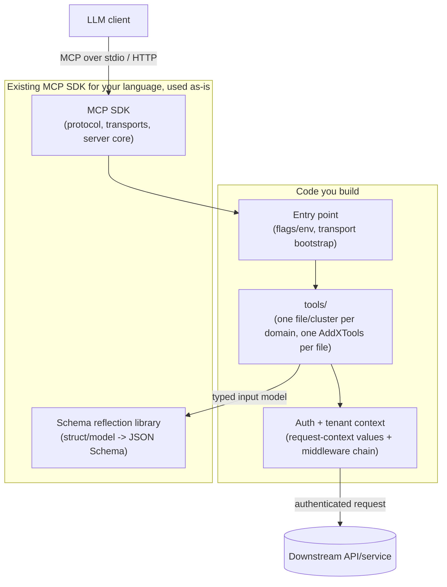

# Lessons for Building a New MCP Server

**Status:** Design guide, derived from reviewing a real production MCP server as prior art.
**Derived from:**
[mcp-grafana-architecture-review](../mcp-grafana-architecture-review/README.md) — a review
of [grafana/mcp-grafana](https://github.com/grafana/mcp-grafana). This document generalizes
what's reusable from that review into a checklist for building a *different* MCP server,
with no relationship to Grafana.

## 1. Purpose

Before designing a new MCP server, it's worth learning from one that already handles real
production concerns — auth, multi-tenancy, caching, observability, and testing at scale —
rather than rediscovering those problems from scratch. This document extracts the patterns
from mcp-grafana that generalize to any MCP server, flags which of its choices are
Grafana-specific and should **not** be blindly copied, and turns the rest into a concrete
checklist.

## 2. How to read this document

Each pattern below states **what it is**, **why it matters** independent of Grafana, and
**how to apply it** in a new, unrelated MCP server. Patterns are ordered roughly from
"almost every MCP server needs this" to "only relevant once the server has grown."

## 3. The reusable patterns

### 3.1 Let the input schema fall out of a typed struct — don't hand-write it twice

**What it is:** Define each tool's input as a plain struct in your language, with metadata
tags describing each field (mcp-grafana uses Go struct tags reflected into JSON Schema via
`invopop/jsonschema`). Generate the tool's advertised schema from that struct instead of
maintaining a separate schema document.

**Why it matters:** A hand-written schema and a hand-written parser inevitably drift apart —
someone adds a field to the struct and forgets the schema, or vice versa. Reflecting one
from the other makes drift structurally impossible.

**How to apply it:** Whatever language you use almost certainly has a struct/schema
reflection library (Pydantic in Python does this natively; Zod in TypeScript serves the same
role). Pick the type of your handler function's input parameter as the single source of
truth, and validate incoming calls against the same reflected schema you advertise —
mcp-grafana additionally rejects unknown argument keys outright rather than silently
dropping them, which is worth copying: a silently-ignored typo is a worse failure mode for
an LLM caller than an immediate, explicit error.

### 3.2 One file (or small cluster) per tool domain, with a single registration table

**What it is:** Group tools by the domain they operate on (in mcp-grafana: dashboards,
alerting, Prometheus, Loki, ...), one file per domain, each exposing one
`AddXTools(server)`-shaped entry point. A single table elsewhere in the codebase lists every
domain, its registration function, and its human-readable description — and that same table
drives both actual registration *and* whatever "here's what this server can do" text you
advertise to clients.

**Why it matters:** Once a server has more than a handful of tools, scattering registration
calls across `main()` becomes unreadable, and a separately maintained "list of capabilities"
document silently goes stale. A single table used for both jobs can't drift.

**How to apply it:** Even a small new MCP server benefits from this from day one — it costs
nothing when there are only three tools, and it's what prevents a rewrite when there are
thirty.

### 3.3 Thread auth and per-request context through the language's request-context
mechanism, never through parameters

**What it is:** Carry request-scoped data (which credential to use, which tenant/org,
tracing metadata) via the ambient request-context primitive your language/framework
provides (Go's `context.Context`; Python's `contextvars` or a framework's request-scoped
state), and compose cross-cutting behavior (auth headers, tenant routing, tracing) as
middleware/interceptors that read from that context — not as extra parameters threaded
through every function signature.

**Why it matters:** mcp-grafana keeps *who is allowed to call this server* (caller auth,
stripped before forwarding) strictly separate from *what credential the server presents
downstream* (Grafana auth) precisely because both live as independent, composable pieces of
context/middleware rather than tangled function arguments. That separation is what makes
multi-tenant support (many callers, many downstream targets, one running process) tractable
at all.

**How to apply it:** Even a single-tenant server benefits — it's the difference between
"add multi-tenancy later" being a contained change to the context/middleware layer, versus a
rewrite of every function signature in the codebase.

### 3.4 Cache expensive downstream clients, keyed by full credential + target identity

**What it is:** If building a client to a downstream API is expensive (TLS handshake setup,
an initial capability-discovery call), cache the constructed client rather than rebuilding
it per request — but key the cache by the *entire* identity that determines client
behavior (target URL, credential, tenant/org, any forwarded headers), not just the URL, and
use a "build once even under concurrent first-requests" primitive (Go's `singleflight`; a
lock plus a pending-future pattern in other languages) so concurrent cache misses for the
same key don't all pay the construction cost.

**Why it matters:** Skipping this either means paying real latency/resource cost on every
call (rebuilding clients constantly) or, if the cache key is too coarse, silently serving one
tenant's response using a different tenant's credential.

**How to apply it:** Only relevant once the server talks to a downstream service with
non-trivial client construction cost and serves more than one caller/tenant per process
(mcp-grafana explicitly skips this for its single-tenant `stdio` transport — there's nothing
to cache across requests when there's only one caller). Start without it; add it when a
multi-tenant transport is introduced.

### 3.5 Read-only vs. read-write tool variants, chosen at startup, sharing one tool name

**What it is:** For any tool that can mutate state, define two handler variants (read-only
and read-write) and pick which one gets registered based on a startup flag — while keeping
the externally-visible tool name identical either way.

**Why it matters:** Lets an operator run a strictly read-only deployment (a common safety
requirement for anything touching production infrastructure) without the LLM client seeing a
different tool surface, and keeps any "is this destructive?" annotation the protocol
supports accurate per variant.

**How to apply it:** Apply this to any tool wrapping a mutation, from the first version of
the server — it's cheap to build in early and expensive to retrofit once real deployments
depend on today's tool names.

### 3.6 Coerce common LLM argument mistakes, but only after a fast strict-parse path fails

**What it is:** Try strict deserialization of incoming arguments first. Only on failure, fall
back to a slower, tolerant pass that fixes the specific mistakes real LLM callers actually
make (a stringified number, a bare value where an array was expected).

**Why it matters:** LLM callers are not hand-written, well-typed API clients — they
occasionally send a technically-wrong-but-obviously-intended value. Rejecting those outright
produces a worse experience than tolerating the handful of known-common mistakes; but paying
reflection cost on every single call (even well-formed ones) is wasteful.

**How to apply it:** Worth doing once real usage surfaces which specific coercions actually
matter for your tools — not something to over-engineer speculatively on day one.

### 3.7 Test each tool without a real backend, using a real local HTTP server, not a mock
framework

**What it is:** Rather than mocking your downstream client library, start a real local HTTP
server (e.g. Go's `httptest.NewServer`, Python's `httpserver`/`responses`) in the test, wrap
it with small composable handlers for whatever cross-cutting endpoints every test would
otherwise need to stub individually, and point your real client at it. The code under test
never knows it isn't talking to the real service.

**Why it matters:** This tests the client code's actual HTTP-level behavior (headers,
retries, error parsing) rather than testing your mocks' behavior, while staying just as fast
and dependency-free as mocking.

**How to apply it:** Applies to any MCP server wrapping an HTTP-based downstream API,
regardless of domain.

### 3.8 Tier your tests to match cost and fidelity, not just "unit vs. everything else"

**What it is:** mcp-grafana uses four tiers: unit (no external dependency, `httptest`-mocked),
integration (a real docker-compose fleet, deliberately running multiple historical versions
of the real dependency to catch compatibility regressions), cloud (against a real hosted
instance, for features with no self-hosted equivalent), and end-to-end (drives the actual
compiled binary through a real LLM, across every supported transport).

**Why it matters:** Each tier catches a different class of bug: unit tests catch logic
errors cheaply and constantly; integration tests catch "does this actually work against the
real thing" and version-compatibility regressions; end-to-end tests catch "does the whole
advertised contract actually work for an LLM," which no lower tier can verify, since schema
correctness and protocol-level behavior are exactly what an LLM client exercises.

**How to apply it:** A new, small MCP server doesn't need all four tiers on day one — start
with unit tests plus a thin end-to-end smoke test that actually drives the binary through a
real LLM call for the two or three most important tools. Add an integration tier once the
server has a downstream dependency worth testing against for real, and a "multiple versions"
fleet only if the downstream API is known to have compatibility-breaking version skew (a
Grafana-specific concern from a company that ships many Grafana versions — not a default
every new server needs).

### 3.9 Treat tool-schema size as a measured, regression-tested resource

**What it is:** Every tool's schema and description consume LLM context on every single
call. mcp-grafana runs a CI check comparing the total token cost of all advertised schemas
against a baseline, failing the build if it grows unexpectedly.

**Why it matters:** Schema bloat is invisible in normal code review (a schema "looks fine" a
field at a time) but compounds silently across dozens of tools, degrading every single call
a client makes to the server, not just the one tool that grew.

**How to apply it:** Worth adopting once a server has enough tools (roughly a dozen or more)
that schema bloat is a real risk — for a first version with a handful of tools, manual
awareness is enough; automate it once the tool count grows.

## 4. What NOT to blindly copy

A few of mcp-grafana's choices are specific to Grafana's domain and its scale as a widely-
deployed product, not general MCP-server requirements:

- **Discovering and proxying other MCP servers hosted behind datasources** — this exists
  because Grafana datasources (like Tempo) can themselves expose MCP servers; it has no
  analog unless your server's downstream dependencies are themselves MCP-aware.
- **A Kubernetes-shaped resource client for API-version capability detection** — specific to
  Grafana's own "app platform" API design, not a general pattern for talking to arbitrary
  REST APIs.
- **Four distribution channels from one codebase** (raw binary, Docker image, Claude Code
  plugin, Gemini CLI extension, MCP Registry listing) — appropriate for a widely-used public
  tool; a first version of a new, narrowly-scoped server should ship through whichever one or
  two channels its actual users need, and add more only once real demand shows up.
- **A docker-compose fleet running three historical versions of the same dependency** — only
  worth it if your downstream API is known to have meaningful version-compatibility drift
  across versions you must support simultaneously.

## 5. Generic reference architecture for a new MCP server

## 6. Checklist for a new MCP server

| Question | Default answer for a first version |
|---|---|
| How is each tool's input schema defined? | A typed struct/model per tool, schema reflected from it — never hand-written separately |
| How are tools organized? | One file per domain, one registration function per file, one table driving both registration and advertised capabilities |
| How does auth/tenant info reach a handler? | Through the language's ambient request-context mechanism, set once per request, read by middleware |
| Do read-only and mutating variants of a tool share a name? | Yes, chosen by a startup flag, from the first tool that can mutate anything |
| Is a downstream client cache needed yet? | Only once a multi-tenant transport exists; key by full credential + target identity if so |
| How are tools tested? | Unit tests against a real local HTTP server standing in for the downstream API; a thin end-to-end smoke test through a real LLM call |
| Is schema-size regression testing needed yet? | Not for a first handful of tools; add once tool count grows past roughly a dozen |
| Which distribution channels? | Whichever one or two your actual first users need — don't build all of them speculatively |

## 7. Glossary

| Term | Meaning |
|---|---|
| **Schema reflection** | Generating a JSON Schema automatically from a typed struct/model, instead of writing the schema by hand |
| **Request context** | A language/framework's mechanism for carrying request-scoped values (auth, tenant, tracing) through a call without passing them as explicit parameters everywhere |
| **Singleflight** | A concurrency pattern collapsing many simultaneous requests for the same not-yet-computed value into one computation |
| **Schema bloat** | Tool schemas/descriptions growing large enough to noticeably consume LLM context budget on every call |

## 8. Frequently asked questions

**Do I need multi-tenancy from day one?**
No — mcp-grafana itself only pays for client caching and per-request credential extraction
on its multi-tenant transports; its single-tenant `stdio` transport skips both. Build the
context/middleware seam in from day one (Section 3.3), but defer caching and multi-tenant
transport support until an actual second tenant exists.

**Which MCP SDK should the new server use?**
Not decided by this document — see Section 9. mcp-grafana's choice of the third-party
`mark3labs/mcp-go` over Anthropic's official SDK was itself a project-specific decision made
before an official Go SDK matured; it isn't evidence either way for a server in a different
language.

**Is the four-tier testing strategy overkill for a small project?**
For a first version, yes — start with unit tests plus one real end-to-end smoke test
(Section 3.8). Add tiers as the server's actual dependencies and deployment risk grow, not
speculatively.

## 9. Open questions for review

- What is the new MCP server actually for — which downstream service/domain does it wrap?
- Which language and MCP SDK will it use, and does that SDK have an equivalent
  schema-reflection library (Section 3.1)?
- Does it need multi-tenancy (many callers, many downstream credentials) from the start, or
  can that be deferred per Section 3.3/3.4?
- Which tools are read-only vs. mutating, and should mutating ones ship behind a
  write-enabled flag from day one (Section 3.5)?
- Which one or two distribution channels (raw binary, Docker, an editor/agent plugin, the
  MCP Registry) matter for its actual first users?
