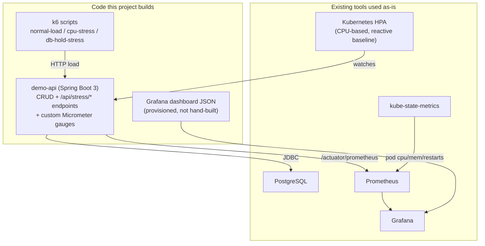

# Proactive SRE Agent: An MCP-Driven System That Fixes Issues Before They Happen

**Status:** Design proposal. Phase 1 (the observable base system) implemented in
[`projects/proactive-sre-agent`](../../projects/proactive-sre-agent/README.md); the agent
itself (Phase 2) is not yet implemented.

## 1. Problem statement

Standard Kubernetes autoscaling (HPA) and most on-call tooling are **reactive**: they act
after a metric crosses a fixed threshold (CPU > 80%, error rate > 1%), by which point users
have already seen degraded latency or errors. They also act on a single metric in
isolation — an HPA scaling on CPU has no notion that a connection pool is simultaneously
climbing toward exhaustion, or that CPU is climbing at a rate that will breach the
threshold in 90 seconds regardless of the current instantaneous value.

**Objective:** build a system where an agent, reading the same metrics a human SRE would
watch in Grafana, recognizes a developing problem from its *trend* — before any threshold
is breached — and takes a corrective action (scale, restart, raise a limit) through a
controlled, auditable path, demonstrably sooner than a vanilla threshold-based HPA reacting
to the same underlying load.

This is a two-phase project:
- **Phase 1** (this repo, `projects/proactive-sre-agent`): a small observable system —
  API + DB + Prometheus + Grafana, deployed to a local Kubernetes cluster, with endpoints
  that can be driven into known failure modes on demand, plus a baseline HPA as the
  "reactive" control group.
- **Phase 2** (future): the agent itself — reads Grafana via an MCP server, reasons about
  trend vs. threshold, and acts via a Kubernetes MCP server.

## 2. Prior art

- **[k8sgpt](https://github.com/k8sgpt-ai/k8sgpt)** — deterministic analyzers collect
  structured cluster facts first; an LLM only explains pre-verified facts, never queries
  the cluster directly. Diagnostic, not actuating — it does not change cluster state.
- **[martinimarcello00/SRE-agent](https://github.com/martinimarcello00/SRE-agent)** —
  LangGraph + MCP multi-agent system for Kubernetes incident *detection and diagnosis*.
  Closest generic analog to this project's agent layer, but reactive (incident has
  already started) and diagnostic rather than actuating.
- **[grafana/mcp-grafana](https://github.com/grafana/mcp-grafana)** — reviewed in depth in
  [`mcp-grafana-architecture-review`](../mcp-grafana-architecture-review/README.md) in this
  repo. This is the MCP server Phase 2 will use to read metrics; no changes needed to it.
- **Kubernetes HPA / VPA / KEDA** — all threshold- or current-value-based, not
  trend-aware. HPA is used here deliberately as the "dumb" baseline to beat, not replaced
  outright — Phase 2 should be shown to act earlier than HPA on the same load curve, not
  merely duplicate what HPA already does.
- **Predictive autoscaling research** (e.g., time-series forecasting ahead of HPA) exists
  in industry (e.g., Google's predictive autoscaling for GKE) but is closed-source and
  cluster-metric-only — it does not reason over an arbitrary mix of app-level and
  infra-level signals the way a Grafana-reading agent can.

**Conclusion:** the diagnostic half of this idea (k8sgpt, SRE-agent) is proven. The gap is
combining *trend-based* (not threshold-based) detection with an *actuating* MCP tool call,
and measuring it against a real HPA baseline on the same injected failure.

## 3. Goals & non-goals

**Goals (Phase 1, in scope now):**
- A backend service with real DB-backed traffic, not a synthetic no-op API.
- On-demand, reproducible triggers for two failure modes: CPU/memory pressure and DB
  connection pool exhaustion — chosen so one is infra-visible (pod CPU/mem) and one is
  app-visible only (Hikari pool state), giving Phase 2 both kinds of signal to read.
  Climbing custom metrics are exposed as **leading indicators**, separate from the
  **lagging indicators** (error rate, latency) that mark actual failure.
- Prometheus + Grafana wired to a single dashboard showing both indicator classes.
- A baseline CPU-based HPA on the service, as the reactive control group for later
  comparison.
- Everything containerized and deployed to a local `kind` cluster, reproducible from
  scratch via scripts.

**Non-goals (Phase 1):**
- The agent itself, Grafana MCP integration, Kubernetes MCP integration, and any
  trend-detection logic — that is Phase 2, designed separately once Phase 1's signals are
  proven to exist and climb visibly.
- Production-grade security, auth, multi-tenancy, HA, or data persistence guarantees —
  this is a lab/demo system, not a product.
- Realistic production load shapes — stress endpoints are intentionally cheap to trigger
  so a demo reaches a visible "about to break" slope quickly.

## 4. How to read the diagrams in this document

Every diagram groups pieces into two categories:
- **Code this project builds** — the actual project.
- **Existing tools used as-is** — infra/libraries depended on rather than reimplemented.

## 5. High-level architecture (Phase 1)

## 6. Components

| Component | Role | Notes |
|---|---|---|
| `demo-api` | CRUD + stress endpoints + metrics | Spring Boot 3, Java 17, Micrometer → `/actuator/prometheus` |
| PostgreSQL | backing store for CRUD, pool-exhaustion target | Small HikariCP pool (e.g. 5) so exhaustion is reachable quickly |
| Prometheus | scrapes `demo-api`, `kube-state-metrics` | ConfigMap-defined scrape config, RBAC for K8s service discovery |
| Grafana | visualizes leading + lagging indicators | Datasource and dashboard provisioned via ConfigMap, not clicked together |
| `kube-state-metrics` | pod-level CPU/mem/restart facts | Standard upstream manifests |
| HPA | reactive baseline control group | CPU-based, `kubectl autoscale`-equivalent manifest |
| k6 | load generator | Run as a K8s `Job`, three scenarios, reproducible |

### Stress endpoints (the "leading indicator" mechanism)

| Endpoint | Behavior | Leading indicator (custom gauge) | Lagging indicator (eventual failure) |
|---|---|---|---|
| `POST /api/stress/cpu?seconds=N` | Busy-loop on a bounded worker pool | `stress_active_cpu_tasks` | Pod CPU throttling, HPA scale-out, request latency |
| `POST /api/stress/memory?mb=N` | Allocates and retains N MB until `/api/stress/reset` | `stress_retained_memory_mb` | Pod OOMKill, JVM heap pressure |
| `POST /api/stress/db-hold?connections=N&seconds=N` | Holds N Hikari connections | Hikari `pending` connections (built-in Micrometer metric) | Request latency climbs as other requests wait for a connection, eventual timeout/5xx |

The split matters: Phase 2's entire premise is acting on the *leading* column before the
*lagging* column has any visible effect — so both must exist and be distinguishable in
Grafana.

## 7. End-to-end validation flow

1. Build `demo-api` image, `kind load docker-image` into the cluster (no external registry
   needed for a local `kind` cluster).
2. Apply manifests in order (namespace → postgres → demo-api + HPA → prometheus → grafana
   → kube-state-metrics).
3. Manual curl smoke test of CRUD endpoints — confirms the DB-backed path works.
4. Run k6 `normal-load` — confirm Grafana shows a flat baseline, no indicator climbing.
5. Run k6 `cpu-stress` — confirm `stress_active_cpu_tasks` and pod CPU% climb visibly
   *before* HPA scales out or latency degrades; then confirm HPA eventually does scale out
   (the reactive baseline working as expected, just late).
6. Run k6 `db-hold-stress` — confirm Hikari pending-connections climbs and latency
   degrades as the pool saturates; note HPA does *not* help here (it's CPU-based and this
   failure mode is DB-pool-based, not CPU-based) — this gap is exactly what Phase 2 should
   be able to catch that HPA structurally cannot.
7. Record the timing of each climb-to-failure window; this becomes the benchmark Phase 2's
   agent is measured against in that future design.

## 8. Kubernetes deployment shape

- Namespace `ailab-poc`, plain YAML manifests (no Helm — too little to template usefully).
- `demo-api`: Deployment (1 replica baseline) + Service + explicit `resources.requests`/
  `limits` (CPU and memory) — required for the stress endpoints to trigger real K8s-level
  throttling/OOM, not just app-level symptoms — + HPA (CPU-based, e.g. target 60%,
  min 1/max 4).
- `postgres`: Deployment + Service, `emptyDir` storage (persistence is out of scope).
- `prometheus`: Deployment + Service + ConfigMap (scrape config) + ClusterRole/RoleBinding
  for K8s API read access (service discovery).
- `grafana`: Deployment + Service + ConfigMap (datasource + provisioned dashboard JSON).
- `kube-state-metrics`: standard upstream manifests.
- `k6-load`: a `Job`, re-run per scenario via `kubectl apply`/`kubectl create job --from`.
- Access via `kubectl port-forward` only (Grafana 3000, Prometheus 9090) — no Ingress,
  this never leaves localhost.

## 9. Alternatives considered

- **Skip the HPA baseline, let the agent be the only scaling mechanism.** Rejected: without
  a reactive control group running the *same* injected load, there is no evidence the
  agent did anything better than default Kubernetes behavior — the comparison is the point.
- **Use a synthetic no-op API (no real DB) for lower setup cost.** Rejected: DB connection
  pool exhaustion is one of the two target failure modes and is one of the most common
  real-world "proactive catch" scenarios (noisy neighbor holding connections); it needs a
  real pooled DB to be meaningful, not a mock.
- **Minikube instead of kind.** Rejected for Phase 1: kind is faster to start/tear down for
  iterative manifest development on a laptop; minikube's extra VM realism isn't needed
  since this never targets multi-node behavior.
- **Helm charts instead of plain YAML.** Rejected: five small manifests don't justify
  templating overhead; revisit only if this grows multiple environments.

## 10. Glossary

- **Leading indicator** — a metric that climbs *before* user-visible failure (e.g. retained
  memory, active stress tasks, pending DB connections).
- **Lagging indicator** — a metric that only moves once failure is already visible (error
  rate, p99 latency breach, pod restart count).
- **Reactive baseline** — the Kubernetes HPA, included deliberately as the thing Phase 2
  must be shown to outperform, not merely coexist with.

## 11. Frequently asked questions

**Why Spring Boot instead of something lighter like FastAPI?** It's the user's primary
stack, and Micrometer's Prometheus integration plus Hikari's built-in pool metrics come
for free — less glue code to reach the same observability depth.

**Why cap stress endpoints to be "cheap to trigger"?** This is a demo/lab system; the goal
is a fast, repeatable climb-to-failure window for development iteration, not realistic
production load magnitude.

**Does the HPA get replaced by the agent in Phase 2?** Not necessarily — Phase 2's design
(separate doc) will decide whether the agent supplements HPA (acts earlier, on signals HPA
can't see) or fully replaces it for this demo. Phase 1 doesn't need that decision made yet.

## 12. Open questions for review

- Phase 2 (agent design: Grafana MCP read path, Kubernetes MCP action path, trend-vs-
  threshold decision logic, action audit trail) is intentionally **not** covered here and
  needs its own design doc once Phase 1's signals are validated end-to-end.
- Whether Phase 2 should be allowed to *add* resource limits/replicas only, or also
  perform remediation actions like pod restarts — a safety-scoping question better answered
  once Phase 1's actual failure timelines are observed.
