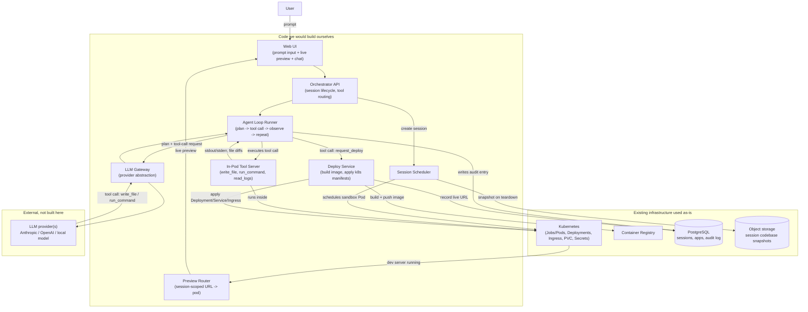
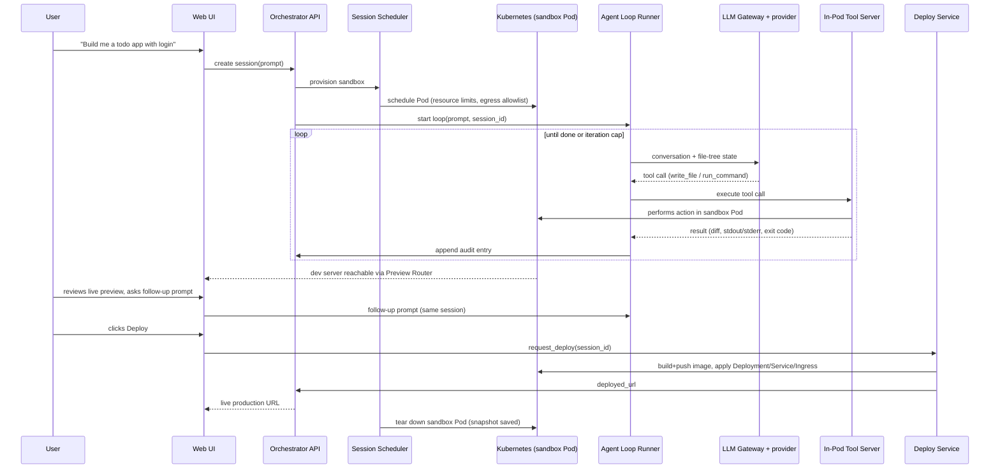

# Shipyard: A Self-Hosted Prompt-to-Deployed-App Platform on Kubernetes

**Status:** Design proposal. Not yet implemented.
**Builds on the same "code we build vs. infrastructure we reuse" framing as:**
[AgentDesk](../agentic-support-platform/README.md) and
[KafkaMind](../kafka-agent-mesh/README.md), applied here to a different problem: generating
and deploying whole applications instead of answering support questions.

## 1. Problem statement

Tools like bolt.new, Lovable, v0, and Replit Agent now take a single natural-language prompt
and produce a working, deployed full-stack application — backend, frontend, database, and
hosting — with no manual scaffolding by the person writing the prompt. This is a real,
fast-moving category, not a novelty: internally we already run RAG, MCP servers and clients,
and agents as *tools* (AgentDesk, KafkaMind); what we don't yet have is a platform where an
agent's tool is "write and run a whole codebase, then put it on the internet."

Every commercial product in this space is either closed-source and hosted-only (Lovable, v0,
Replit Agent) or, where open source exists, built around constraints that don't fit a
self-hosted, on-prem-or-cloud-VM-with-Docker-and-Kubernetes setup: bolt.diy's sandbox runs
*inside the end user's browser tab* via a third-party WASM runtime that requires a commercial
license for production use (Section 2), and Dyad is a single-user local desktop app with no
shared platform or deploy story at all. Neither is a starting point for a **team platform**
that runs on infrastructure we already operate.

**Objective:** design a platform where a user submits a prompt, an agent writes and iterates
on a real full-stack codebase inside an isolated, server-side sandbox we control, the user
gets a live preview while it's being built, and — on request — the agent deploys the finished
application as its own running service on our Kubernetes cluster, with every file write,
command execution, and deploy action going through an auditable tool-call boundary rather than
an agent with free-form shell access to anything it wants.

## 2. Prior art

- **[bolt.new / bolt.diy](https://github.com/stackblitz-labs/bolt.diy)** — the clearest
  existing example of the full loop (prompt → write files → run → observe → fix → deploy).
  Execution happens in **WebContainers**, StackBlitz's real Node.js-via-WebAssembly runtime
  running in the browser tab itself, not on a server; the LLM streams file operations that
  middleware writes straight into the WebContainer filesystem, which auto-runs `npm install`
  and the dev server. This gives a tight client-side agentic loop with zero server compute per
  session, but WebContainers requires a paid commercial license for production/for-profit use
  and is not something we can self-host on our own cluster — it only runs in a browser.
  bolt.diy itself supports 19+ LLM providers via the Vercel AI SDK and deploys to
  Netlify/Vercel/GitHub Pages, none of which is our target (K8s-hosted) deploy surface.
- **[Dyad](https://github.com/dyad-sh/dyad)** — a local-first **Electron desktop app**, not a
  platform. Generated code runs through a `sandbox-worker` process rather than directly on the
  user's filesystem, and the database layer uses Drizzle ORM (SQLite locally, Postgres
  optionally). BYO LLM keys, Apache 2.0 core with a paid "pro" tier under a Functional Source
  License (open-core, delayed-open-source — a monetization pattern, not an architecture
  pattern, but worth noting). There is no multi-user platform, no shared sandbox
  orchestration, and no deploy-to-production story — it is a local tool for one developer at a
  time.
- **[OpenHands](https://github.com/All-Hands-AI/OpenHands)** (formerly OpenDevin) — the
  closest architectural ancestor for *our* infrastructure. A Python **Agent Server** behind a
  REST API, decoupled from its React/TypeScript UI, with explicitly tiered sandbox isolation:
  direct host execution (local-only, not safe for multi-tenant use) → a single Docker
  container per conversation → one Docker instance (agent server + tools) spawned per
  conversation → dispatch to a remote VM. It is explicitly designed to run "locally, in
  Docker, on VMs, or anywhere you can run an agent server backend," and is model-agnostic via
  an Agent-Client Protocol. It does not, however, ship a built-in "generate a full-stack app
  and deploy it as a new live service" workflow — it's a general autonomous coding agent (fix
  this issue, open this PR), not an app-builder-to-production pipeline. Its per-session
  container isolation model is what Section 5–8 of this document adopts.
- **[Dify](https://github.com/langgenius/dify)** — the most-starred self-hostable agentic/RAG
  platform, but it's a workflow/pipeline builder (drag-and-drop LLM pipelines, 100+ model
  providers, built-in observability), not a code-generation-and-deploy tool. Relevant as a
  reference for how a self-hosted, multi-tenant LLM platform structures provider abstraction
  and observability, not for the sandbox/deploy problem itself.

**Conclusion:** the agentic generate-run-fix loop is well-proven (bolt.diy); per-session
server-side sandbox isolation on exactly our kind of infrastructure is well-proven separately
(OpenHands). Nothing reviewed combines that isolation model with an explicit, agent-callable
**deploy-to-Kubernetes** step that turns a finished session into a new standalone running
service. That combination is the actual gap this design fills.

## 3. Goals & non-goals

**Goals**
- A user submits a prompt (optionally iterating with follow-up prompts) and gets a working
  full-stack codebase, generated and executed inside a sandbox we control — not the user's
  browser, not a third-party WASM runtime requiring a commercial license.
- A live preview of the running app is reachable from the browser while the session is active.
- Deployment is an explicit, agent-callable **tool**, not something baked automatically into
  code generation: `request_deploy` builds a production image and stands up a real Kubernetes
  Deployment + Service + Ingress for the generated app, returning a live URL.
- Every agent action — file write, shell command, deploy — goes through a defined tool
  boundary with a recorded audit entry; the agent never gets unscoped shell/cluster access.
- Runs on Kubernetes using primitives we already operate (Deployments, Jobs, PVCs, Secrets,
  Ingress), on-prem VM or cloud, with Docker as the per-session execution unit.
- Model-agnostic LLM access (matching the pattern already used in AgentDesk/KafkaMind), so the
  platform isn't locked to one vendor.

**Non-goals (v1)**
- **Browser-native sandboxing.** We are not building or licensing a WebContainers-equivalent;
  execution is always server-side, inside a container we schedule (Section 5).
- **Arbitrary production infrastructure generation.** v1 deploys generated apps onto our own
  cluster as Deployment + Service + Ingress; provisioning arbitrary cloud resources (managed
  message queues, CDNs, third-party SaaS) on a user's behalf is out of scope.
- **Multi-cloud deploy targets.** v1 ships to the Kubernetes cluster the platform itself runs
  on. Deploying generated apps to a *different*, user-specified cluster or cloud account is a
  plausible v2 extension (Section 11), not built now.
- **Collaborative multi-user editing of one session.** v1 is one user per build session,
  matching bolt.diy/Dyad; real-time multi-user collaboration on the same generated codebase is
  out of scope.
- **Unbounded agent autonomy.** The agent loop is iteration-capped and tool-scoped (Section
  8.2); it is not given a long-running, unsupervised mandate the way some "set it and forget
  it" autonomous-agent framings are.

## 4. How to read the diagrams in this document

Same grouping convention as this repo's other designs:
- **Code we would build ourselves** — the platform's own services.
- **Existing infrastructure used as-is** — Kubernetes primitives, PostgreSQL, object storage,
  a container registry, and an ingress/reverse proxy.
- **External, not built here** — the LLM provider(s) the agent calls into.

## 5. High-level architecture



**Why a separate Tool Server inside the sandbox pod instead of the Agent Loop Runner acting
directly on the pod's filesystem:** this mirrors OpenHands' own separation of the agent
process from the thing it operates on, and gives us one narrow, auditable interface
(`write_file`, `run_command`, `read_logs` — nothing else) between "the LLM decided to do X"
and "X actually happened to a real filesystem/process," the same way AgentDesk's Verifier sits
between a drafted answer and what gets said to a user. An agent that can issue a raw shell
session has no such boundary; here every action is a named, loggable tool call.

## 6. Components

### 6.1 Web UI (code we build)

Prompt input, chat-style follow-up for iterating on the session, an embedded live-preview
frame pointed at the Preview Router's session URL, and a "Deploy" action that sends the
`request_deploy` tool call on the user's behalf (the agent can also trigger it autonomously if
the user's prompt asks for it directly — both paths go through the same Deploy Service).

### 6.2 Orchestrator API (code we build)

Owns session lifecycle: creates a `sessions` row, asks the Session Scheduler for a sandbox,
and is the single entry point the Web UI and Agent Loop Runner both talk to. Session state:

```
sessions
  id              UUID (PK)
  user_id         UUID
  status          TEXT   -- provisioning | running | idle | deploying | deployed | torn_down
  pod_name        TEXT, nullable
  preview_url     TEXT, nullable
  deployed_url    TEXT, nullable
  created_at      TIMESTAMPTZ
  last_active_at  TIMESTAMPTZ
```

### 6.3 Session Scheduler (code we build)

Schedules one Kubernetes Pod per session on request, each in its own namespace (or at minimum
its own strict `NetworkPolicy`), with CPU/memory resource limits, a non-root container, and an
egress allowlist (package registries only — no arbitrary outbound). Tears a pod down after an
idle timeout, snapshotting the codebase to object storage first so a session can be resumed.
This is a direct application of OpenHands' "one Docker instance per conversation" tier
(Section 2), chosen over direct host execution specifically because this platform is
multi-tenant.

### 6.4 Agent Loop Runner (code we build)

The plan → tool-call → observe → repeat loop, iteration-capped (Section 8.2). For each
iteration it sends the current conversation and file-tree state to the LLM Gateway, receives
either a tool call or a final response, executes the tool call via the in-pod Tool Server,
appends the result as an observation, and loops until the LLM reports done or the iteration
cap is hit. Structurally the same shape as AgentDesk's Planner, except the "tools" here are
filesystem/process operations and a deploy action instead of document retrieval and MCP calls.

### 6.5 In-Pod Tool Server (code we build)

A small HTTP server running inside each sandbox pod, exposing exactly three tool endpoints:

| Tool | Does | Does not |
|---|---|---|
| `write_file` | Create/update/delete one file at a given path within the session workspace | Write outside the workspace root |
| `run_command` | Execute one shell command (e.g. `npm install`, `npm run build`, `pytest`), capture stdout/stderr/exit code, with a timeout | Run as root; run commands outside an allowlisted set of package managers/runtimes if a stricter mode is enabled (Section 9) |
| `read_logs` | Tail the dev server's current stdout/stderr | Access any other pod or namespace |

The Agent Loop Runner never gets a raw shell into the pod — only these three operations,
each individually recorded.

### 6.6 LLM Gateway (code we build)

Provider abstraction (Anthropic, OpenAI, local models via an OpenAI-compatible endpoint),
normalizing tool-calling/function-calling across providers so the Agent Loop Runner's loop
logic doesn't change when the model changes — the same reason bolt.diy and Dyad both chose
multi-provider abstractions (Vercel AI SDK, BYO keys respectively) over hardcoding one vendor.

### 6.7 Preview Router (code we build)

Maps a session's `preview_url` (a session-scoped subdomain or path, e.g.
`<session-id>.preview.shipyard.internal`) to the running dev server inside that session's pod,
so the Web UI's embedded preview always points at the live, currently-building app.

### 6.8 Deploy Service (code we build)

The only component that turns a session's codebase into a standalone running service:
1. Builds a production container image from the session's final file tree (via a generated
   Dockerfile or a buildpack — open question, Section 14) and pushes it to the Container
   Registry.
2. Applies a Deployment + Service + Ingress for the new app to Kubernetes, in a namespace
   separate from the sandbox pods.
3. If the generated app declares a database dependency, provisions it (Section 9 — open
   question on shared vs. dedicated instance).
4. Writes the resulting `deployed_url` back to the `sessions` row and ends the build session's
   active sandbox (the deployed app is now its own long-lived workload, independent of the
   ephemeral session pod that built it).

## 7. End-to-end build-and-deploy flow



## 8. LLD — sandbox lifecycle and agent loop contract

### 8.1 Sandbox pod lifecycle

1. **Provision** — Session Scheduler schedules a Pod from a base image with common
   runtimes (Node.js, Python) pre-installed, mounts an ephemeral workspace volume, and starts
   the In-Pod Tool Server as the pod's entrypoint.
2. **Active** — the Agent Loop Runner drives tool calls against it; `last_active_at` on the
   session row updates on every tool call.
3. **Idle teardown** — if `last_active_at` exceeds an idle threshold (default: 20 minutes) and
   no deploy is in progress, the workspace is snapshotted to object storage and the Pod is
   deleted. A later prompt from the same user restores the snapshot into a fresh Pod.
4. **Deploy teardown** — once `request_deploy` completes successfully, the sandbox Pod is torn
   down immediately (its job is done; the deployed app is now a separate, independent
   workload managed by the Deploy Service's own Deployment object).

### 8.2 Agent loop contract

```json
{
  "iteration": 4,
  "max_iterations": 40,
  "tool_call": {
    "tool": "run_command",
    "arguments": { "command": "npm run build" }
  },
  "result": {
    "exit_code": 1,
    "stdout": "...",
    "stderr": "Module not found: 'bcrypt'",
    "duration_ms": 1830
  }
}
```

Every iteration is appended to the session's audit log (`sessions` → `tool_calls`, one row
per call) with the same intent AgentDesk's Finding records serve: nothing the agent did is
reconstructable only from memory or a chat transcript — it's a queryable record of every file
write, command, and deploy action, in order. The loop terminates when the LLM's response
contains no further tool call (it considers the task done), the iteration cap is hit (surfaced
to the user as "stopped after N steps — continue?"), or a tool call errors in a way flagged
non-recoverable (e.g. `write_file` rejected for an out-of-workspace path).

## 9. Kubernetes deployment shape

| Component | Kubernetes shape | Notes |
|---|---|---|
| Web UI | Deployment + Service + Ingress | Stateless |
| Orchestrator API | Deployment + Service | Stateless REST API in front of PostgreSQL |
| Session Scheduler | Deployment (controller) | Watches `sessions` table / a queue; creates/deletes sandbox Pods |
| Sandbox Pod (per session) | Pod, one per active session, own namespace or strict `NetworkPolicy` | Non-root, resource-limited, egress-allowlisted; this is the per-tenant isolation boundary |
| Agent Loop Runner | Deployment, or co-located with Orchestrator | Stateless relative to any one session; session state lives in PostgreSQL |
| In-Pod Tool Server | Runs inside each sandbox Pod as entrypoint, not a separate Deployment | One instance per session, dies with the Pod |
| Preview Router | Deployment + Service + Ingress with dynamic routing (session-id -> Pod) | Needs a routing layer that can resolve session-scoped hostnames/paths to the right Pod |
| Deploy Service | Deployment + Service | Needs RBAC to create Deployments/Services/Ingresses in the "deployed apps" namespace, and registry push credentials |
| PostgreSQL | StatefulSet (or managed instance) | Sessions, audit log (`tool_calls`), deployed-app registry |
| Object storage | External (S3-compatible) or in-cluster (MinIO) | Session codebase snapshots for idle-resume |
| Container Registry | External or in-cluster | Deploy Service pushes here; deployed-app Deployments pull from here |

Deployed applications (the output of `request_deploy`) live in their own namespace, separate
from both the platform's own services and from sandbox Pods — so a bug in one generated app's
Deployment can't be confused with, or granted access to, the platform's own control plane.

## 10. Security & isolation model

- **Per-session Pod isolation.** Each sandbox Pod is its own tenant boundary: own namespace
  or `NetworkPolicy`, non-root, CPU/memory limits, no access to the cluster's own Secrets or
  service accounts, and an egress allowlist restricted to package registries — directly
  adopting OpenHands' per-conversation Docker isolation tier rather than direct host
  execution.
- **No raw shell for the agent.** The Agent Loop Runner only ever calls the three named tools
  on Section 6.5's Tool Server; there is no code path where the LLM's output is executed as an
  unparsed shell string against the host or the orchestrator.
- **Every tool call is audited.** Section 8.2's `tool_calls` log is append-only and tied to a
  `session_id` and `user_id` — if a generated app later misbehaves, the exact sequence of
  writes and commands that produced it is reconstructable.
- **Deploy is a privileged, separately-scoped action.** Only the Deploy Service holds RBAC to
  create resources in the "deployed apps" namespace; the sandbox Pod and the Agent Loop Runner
  never have direct Kubernetes API access themselves — `request_deploy` is a message to the
  Deploy Service, not a credential handed to the agent.
- **Resource and cost bounds.** Iteration cap (Section 8.2), idle-teardown (Section 8.1), and
  per-session CPU/memory limits bound both blast radius and infrastructure cost of a single
  runaway session.

## 11. Alternatives considered

**A. Browser-native sandbox via WebContainers, bolt.diy-style (rejected)** — zero server
compute per session is attractive, but WebContainers requires a commercial license for
production use and fundamentally cannot run on our own cluster (it executes in the end user's
browser, not on infrastructure we operate). Rejected because it conflicts with the stated
objective of a self-hosted platform on infrastructure we already run.

**B. Local-first desktop tool, Dyad-style (rejected)** — simplest to build, no multi-tenant
isolation problem at all, but it is a single-user tool with no shared platform and no deploy
story, which doesn't meet the goal of a team-usable platform with real production deploy.

**C. VM-per-session via Firecracker microVMs instead of Docker containers (deferred, not
rejected)** — stronger isolation than a container (separate kernel per session), which matters
more as untrusted-code-execution risk grows, but meaningfully higher operational complexity
than Docker on Kubernetes we already run. Deferred: start with container-level isolation
(Section 10) and revisit if container-escape risk or multi-tenant trust requirements increase
enough to justify it — the same kind of "reasonable v2, not guessed at now" deferral AgentDesk
used for its generic tool-pack fallback.

**D. Agent with direct filesystem/shell access to the sandbox Pod instead of a Tool Server
(rejected)** — fewer moving parts, but removes the one narrow, auditable boundary between "the
LLM decided to do X" and "X happened" (Section 5's rationale); rejected for the same reason
AgentDesk's Verifier exists — a mechanical boundary around what an LLM-driven process can
actually do is a stronger guarantee than trusting the loop not to go wrong.

## 12. Glossary

| Term | Meaning |
|---|---|
| **Session** | One build conversation: a prompt plus follow-ups, bound to one sandbox Pod and one codebase, until torn down or deployed |
| **Sandbox Pod** | The per-session, isolated Kubernetes Pod where generated code is actually written and run |
| **Tool call** | A single named, audited action the agent requests (`write_file`, `run_command`, `read_logs`, `request_deploy`) |
| **Agent Loop Runner** | The service driving the plan -> tool-call -> observe -> repeat cycle for one session |
| **Deploy Service** | The only component with Kubernetes RBAC to turn a finished session's codebase into a standalone running Deployment |
| **Idle teardown** | Automatic snapshot-and-delete of a sandbox Pod after a period of inactivity, resumable from object storage |

## 13. Frequently asked questions

**Why not let the agent call the Kubernetes API directly to deploy?**
Because that would hand a credential with cluster-write access to a process driven by LLM
output. The Deploy Service holds that RBAC instead, and `request_deploy` is a message to it,
not a credential handed to the agent (Section 10).

**What happens if `npm install` or a build step needs a package the egress allowlist blocks?**
The `run_command` tool call returns a non-zero exit code and the relevant stderr, same as any
other failed command; the agent sees this as an observation and can report it to the user
rather than the platform silently widening egress. Whether to support a per-session,
user-approved egress exception is an open question (Section 14).

**Can a session be resumed after idle teardown?**
Yes — the workspace snapshot in object storage (Section 8.1) is restored into a fresh Pod on
the next prompt against that session; conversation history lives in PostgreSQL independently
of the Pod's lifetime.

**How is this different from just running OpenHands and pointing it at "build and deploy a
web app"?**
OpenHands is a general autonomous coding agent (fix an issue, open a PR) with pluggable
sandbox backends; it doesn't ship an opinionated live-preview-plus-deploy-to-Kubernetes
pipeline. This design borrows its per-session Docker isolation tier (Section 2, Section 10)
but adds the Preview Router and Deploy Service as first-class, purpose-built components for
the specific prompt-to-production workflow.

## 14. Open questions for review

- Final platform name/branding (this document uses "Shipyard" as a working name).
- Production image build strategy: agent-generated Dockerfile vs. a buildpack (e.g. Cloud
  Native Buildpacks) the Deploy Service applies uniformly — not yet decided.
- Database provisioning model for deployed apps: a shared Postgres instance with per-app
  logical databases/schemas, vs. a dedicated instance per deployed app via an operator (e.g.
  CloudNativePG) — tradeoff between operational simplicity and isolation, not yet decided.
- Isolation strength for sandbox Pods: plain Docker/containerd (Section 10) vs. a stronger
  per-session runtime (gVisor, Kata Containers) — deferred per Section 11-C, but the threshold
  for revisiting isn't yet defined.
- Whether a per-session, user-approved egress exception is supported (referenced in Section
  13's FAQ) or the allowlist stays fixed platform-wide.
- LLM provider(s) for v1 and whether local-model support (matching Dyad's and bolt.diy's BYO
  / Ollama options) is in scope from the start or a later addition.
- Multi-cloud / external-cluster deploy targets (Section 3 non-goals) as a named v2 extension
  point, not designed here.
- Exact session-to-preview-URL routing mechanism (session-scoped subdomain vs. path prefix)
  and its interaction with cookies/CORS for apps that set their own — not yet designed.
